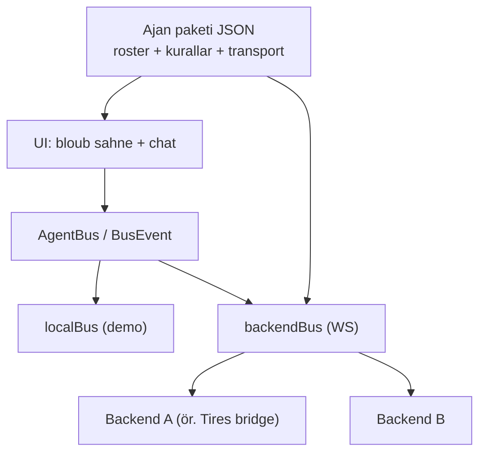

# Multi-Backend Ajan Paketleri — Plan & Takip

Branch: `feature/multi-backend`  
Durum: Faz 0 tamam · Faz 1+ sürüyor  
Kararlar: düz branch (fork yok) · paket formatı **JSON** · demo paket = mevcut avatarlar  
Skill: `codebase-design` kuruldu (`design-an-interface` listeden kalkmış; en yakın karşılık bu)

---

## Amaç

Agent Panel **tek backend’e** bağlı kalmasın. Farklı ajan grupları (Tires Master Data, ileridekiler) ayrı **paket** olarak takılsın; UI yalnız `AgentBus` + aktif paketi bilsin.



---

## Kararlar (kilitli)

| Konu | Karar |
|------|--------|
| Git | Düz branch `feature/multi-backend`; worktree yok; fork yok |
| Paket formatı | JSON (YAML değil) |
| Demo paket | Mevcut 8 avatar (ARIA, BLITZ, …) |
| Fallback | Paket yoksa `src/agents.ts` `AGENTS` |
| UI bozma | Yalnız ekleme; `localBus` varsayılan kalmalı |
| Tires bridge | Bu repoda **değil**; ayrı repoda/dizinde, sonra |
| Skill | `codebase-design` (arayüz/sınır tasarımı) |

---

## Paket şeması (JSON)

```json
{
  "id": "demo-avatars",
  "name": "Demo AI Agent Avatars",
  "transport": "local",
  "url": null,
  "rules": { "handoff": "any", "pairMode": "side" },
  "agents": [
    {
      "id": "ARIA",
      "name": "ARIA",
      "role": "orkestrasyon",
      "shape": "cercle",
      "color": "bleu",
      "expression": "attentif",
      "partners": ["PIXEL", "SAGE"],
      "replies": ["..."],
      "idleState": "idle",
      "thinkState": "thinking",
      "arriveState": "exclaim"
    }
  ]
}
```

- `transport`: `local` | `ws`
- `rules.handoff`: `any` (herkes → herkes) | `none` | ileride kural listesi
- `rules.pairMode`: `side` | `orbit` (varsayılan; `!pair` ile değişir)

---

## Fazlar

### Faz 0 — Güvenli zemin — **TAMAM**
- [x] `feature/multi-backend` branch
- [x] Bu plan dosyası
- [x] Skill: `codebase-design`
- [ ] Origin’e push (kullanıcı isterse)

### Faz 1 — JSON ajan paketi (demo) — **TAMAM**
- [x] `src/pack/types.ts` — `AgentPack`, `PackAgent`, `PackRules`
- [x] `src/packs/demo-avatars.json` — mevcut 8 ajan
- [x] `src/pack/load.ts` — parse + validate (id tekil, zorunlu alanlar)
- [x] `src/pack/fromAgents.ts` — `AGENTS` → pack (fallback üretici)
- [x] `src/pack/builtin.ts` — `DEMO_PACK` (doğrulanmış gömülü)
- [x] Kabul: `npm run build` geçti; UI’a dokunulmadı

### Faz 2 — Ayarlar (paket seç / düzenle) — **TAMAM**
- [x] `src/pack/store.ts` — localStorage (aktif id + custom pack)
- [x] `src/components/PackSettings.vue` — seçim + JSON düzenle/doğrula/kaydet/dışa aktar
- [x] FAB ⚙ (additive)
- [x] Kabul: build geçti; bozuk JSON hata listesi, çökme yok

### Faz 3 — Roster paketten — **TAMAM**
- [x] `src/roster.ts` — aktif roster seam (shallowRef + lookup)
- [x] `App` / `AgentStage` / `ChatDock` / `SideMenu` / `localBus` roster’dan
- [x] Fallback: `AGENTS` (roster boş/başlangıç)
- [x] Kabul: build geçti; paket değişince roster tazelenir

### Faz 4 — backendBus + transport — **TAMAM**
- [x] Ayarlar: `local` / `ws` + `url` + **Bağlan / uygula**
- [x] `backendBus` gerçek WS (`dispatch` → gönder, `onmessage` → `BusEvent`)
- [x] `src/bus/session.ts` — transport seam (local / ws, status ref)
- [x] Rozet: local · demo / ws · bağlı / bağlanıyor / hata
- [x] Kabul: build geçti; `local` varsayılan; paket `transport: ws` → backendBus

### Faz 5 — Tires paketi + bridge — **TAMAM**
- [x] `Tires Master Data/bridge/bus_server.py` — WS `ws://127.0.0.1:8787/bus`
- [x] scrape_run poll → `agent.say` (report_progress note) / `done`
- [x] `user.message` → durum özeti (panel süreç başlatmaz)
- [x] `src/packs/tires-master-data.json` (MICHELIN / CONTI / PIRELLI)
- [x] Gömülü paket listesine eklendi (`BUILTIN_PACKS`)
- [x] `websockets` eklendi (pyproject)
- [x] Kabul: panel build geçti; 3 ajan; bridge `uv run python bridge/bus_server.py`

### Faz 6 — Test — **TAMAM**
- [x] Mock WS: `bridge/mock_bus_server.py` (port 8788)
- [x] E2E: `bridge/smoke_ws_e2e.py` — called/say/done/pair/handoff OK
- [x] `npm test` — localBus summon / multi+pair / handoff / orbit (5 passed)
- [x] `scripts/smoke_packs.py` — demo 8 + tires 3 ajan OK
- [x] `npm run build` geçti

---

## K1 — Konuşan ajanlar (2026-10)

Kararlar:
1. Ajana özel LLM (`pack.agents[].llm` / registry `llm`) → yoksa **merkezi** (`pack.llm` / `_llm`)
2. Alt ajan = şimdilik **transcript** (`PIRELLI.KESIF`); ileride ayrı avatar
3. `start_run` **yok** (K2)

| Parça | Yer |
|-------|-----|
| `agent.task` / `agent.subspawn` / `agent.subdone` | `src/bus/types.ts` + App transcript |
| Pack `llm` + `persona` | `src/pack/types.ts`, `load.ts`, tires pack |
| `bridge/llm.py` | OpenAI-uyumlu; anahtar yoksa fallback |
| `bridge/agent_runtime.py` | persona + status/count araçları + alt ajan |
| `bridge/bus_server.py` | `user.message` → `AgentRuntime` |
| `bridge/test_agent_runtime.py` | smoke |

**K2 (dokunulmadı):** `start_run` aracı + `agent.task` ile tarama başlatma.

---

## Dosya haritası (hedef)

```
src/pack/types.ts          ← paket tipleri
src/pack/load.ts           ← parse/validate
src/pack/fromAgents.ts     ← AGENTS → demo pack
src/packs/demo-avatars.json
src/packs/tires-master-data.json   (Faz 5)
src/bus/*                  ← mevcut (değişmez sözleşme)
src/pairMode.ts            ← mevcut
docs yok — plan bu dosyada
```

---

## Yapıldı / Kalan (kısa)

**Yapıldı (önceki oturumlar, `main` üzerinde)**
- Faz 1–5: `src/bus/` LocalBus + types, App bus’a bağlandı, handoff, pair (side+orbit), `backendBus` stub

**Kalan (bu branch)**
1. ~~Faz 1 — JSON pack + demo~~ **bitti**
2. ~~Faz 2 — Ayarlar UI~~ **bitti**
3. ~~Faz 3 — Roster pack’ten~~ **bitti**
4. ~~Faz 4 — WS backendBus~~ **bitti**
5. ~~Faz 5 — Tires bridge + pack~~ **bitti**
6. ~~Faz 6 — Test~~ **bitti**

---

## Notlar

- `design-an-interface` skill adı artık yok → `codebase-design` kuruldu.
- `git-guardrails-claude-code` kurulmadı (standart git yeterli).
- UI bozma kuralı: her fazda `npm run build` + `localBus` smoke; kırılırsa rollback bu branch’te tek commit.
